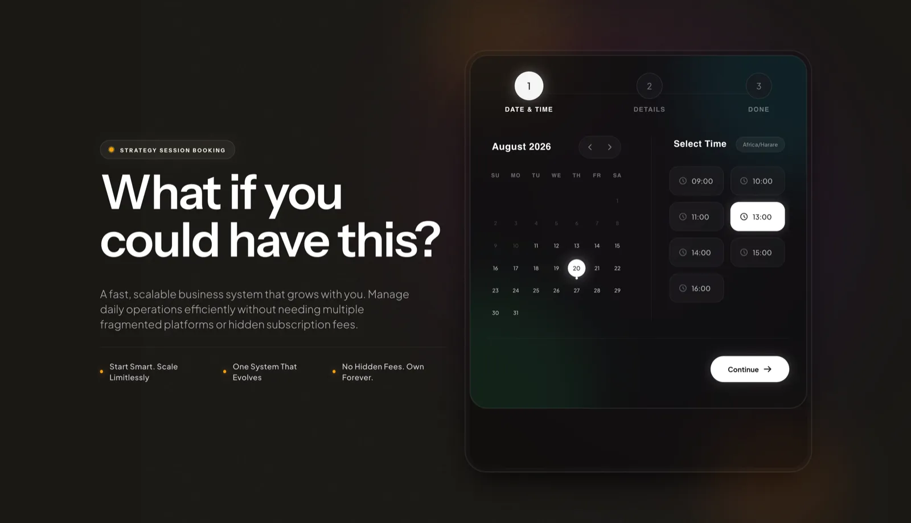
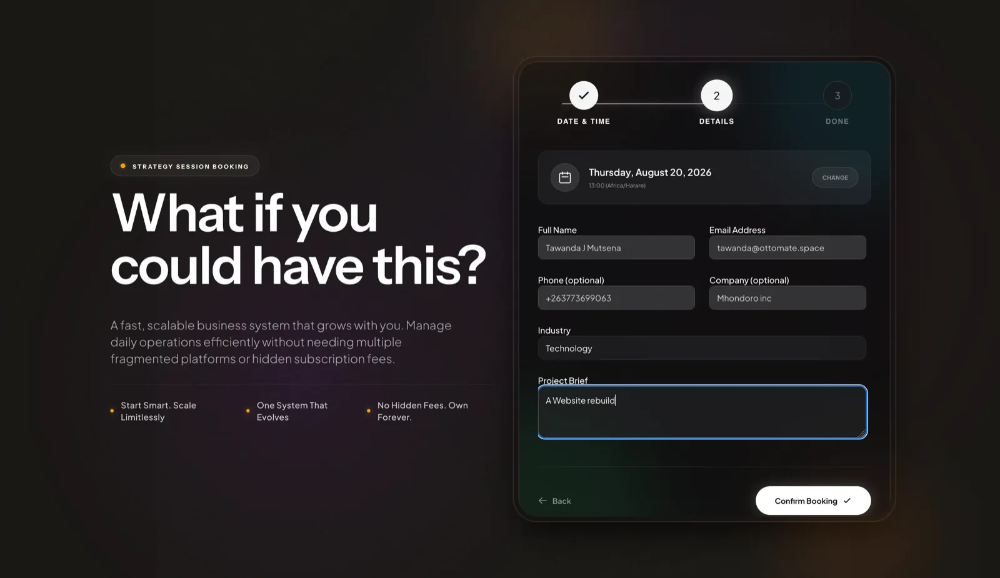
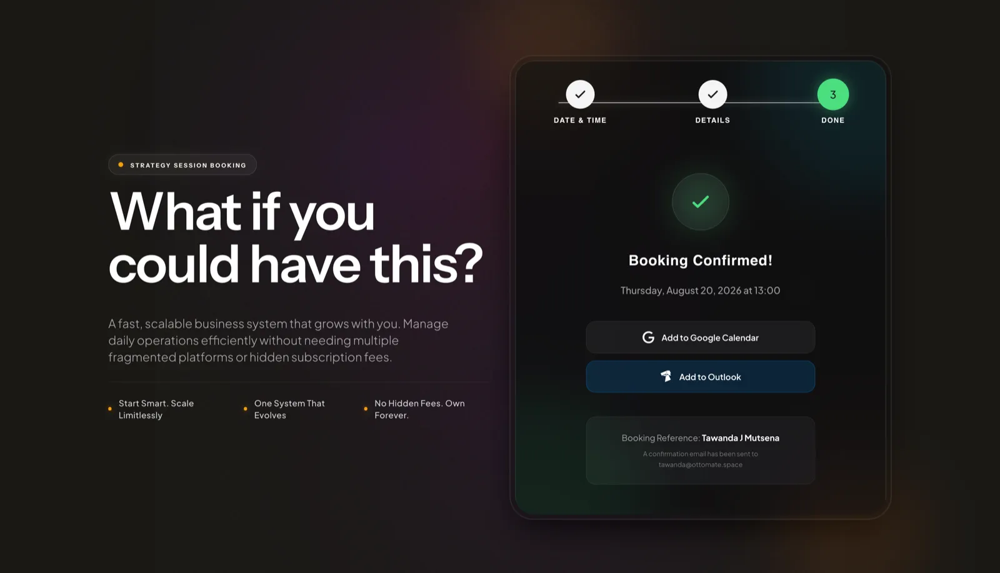
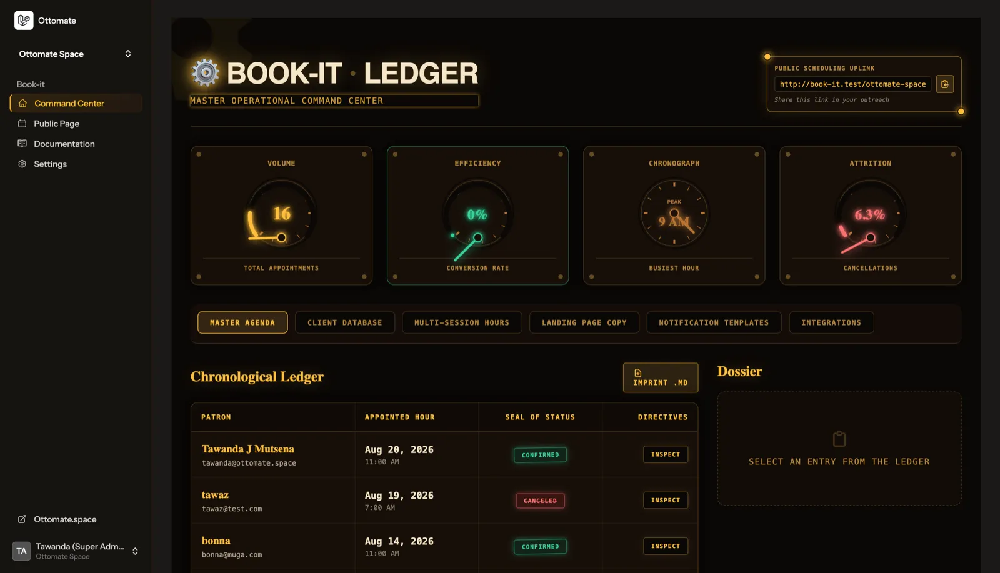
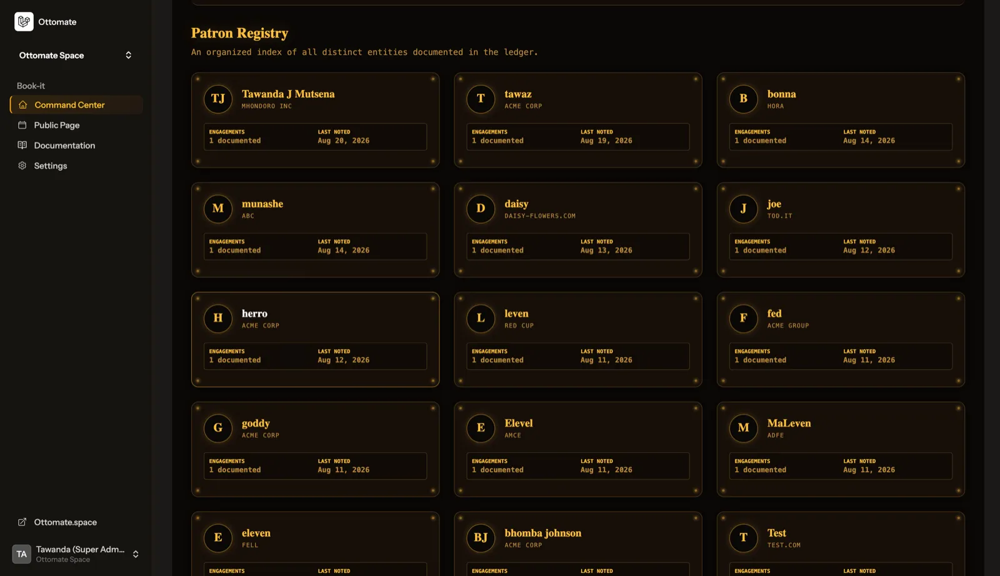
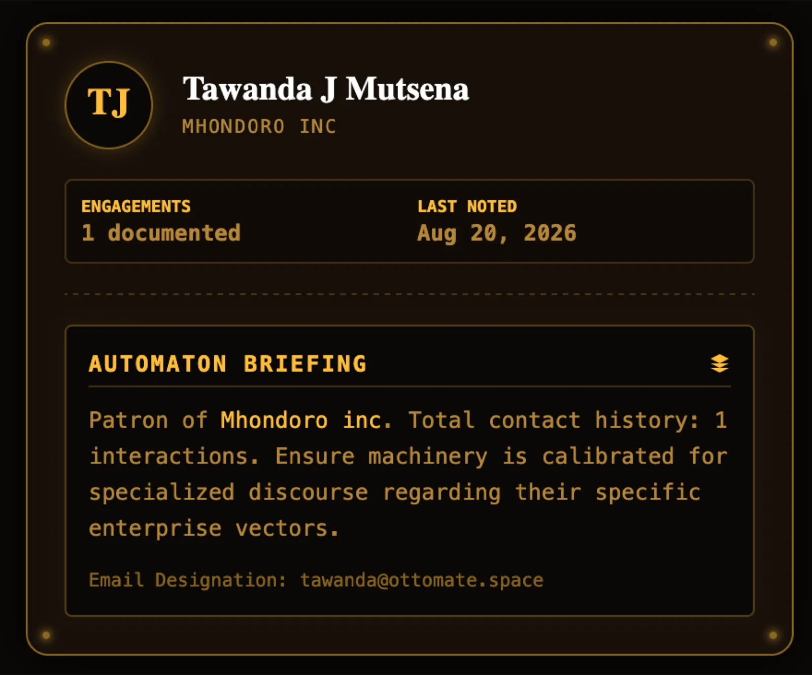
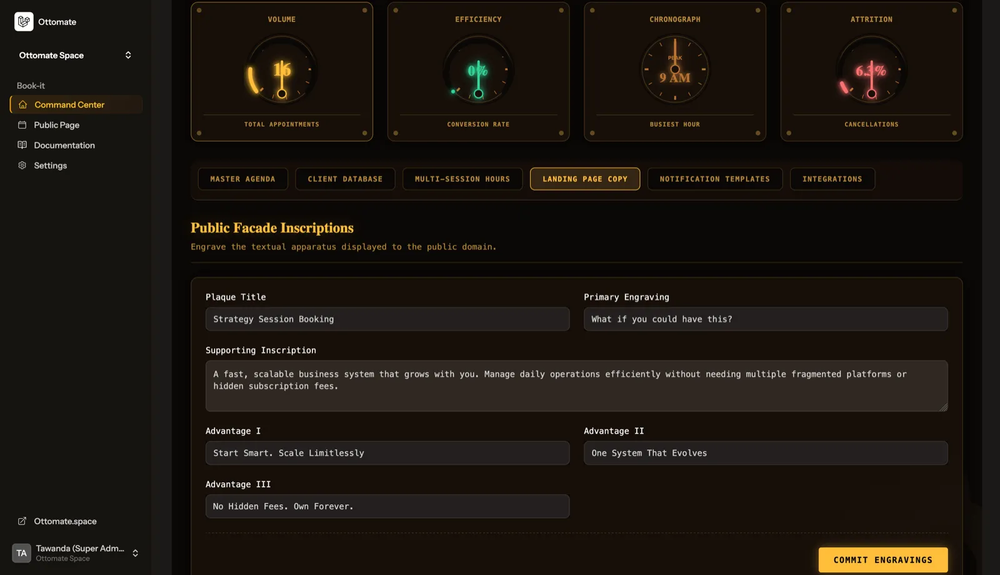
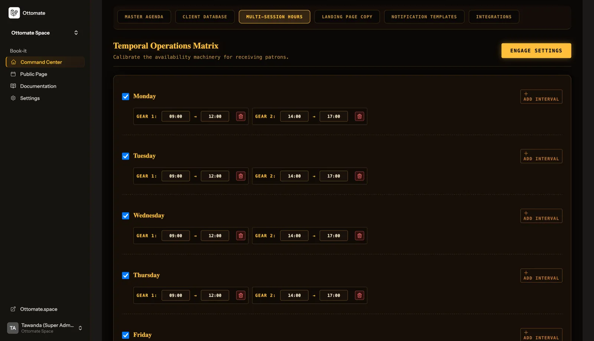
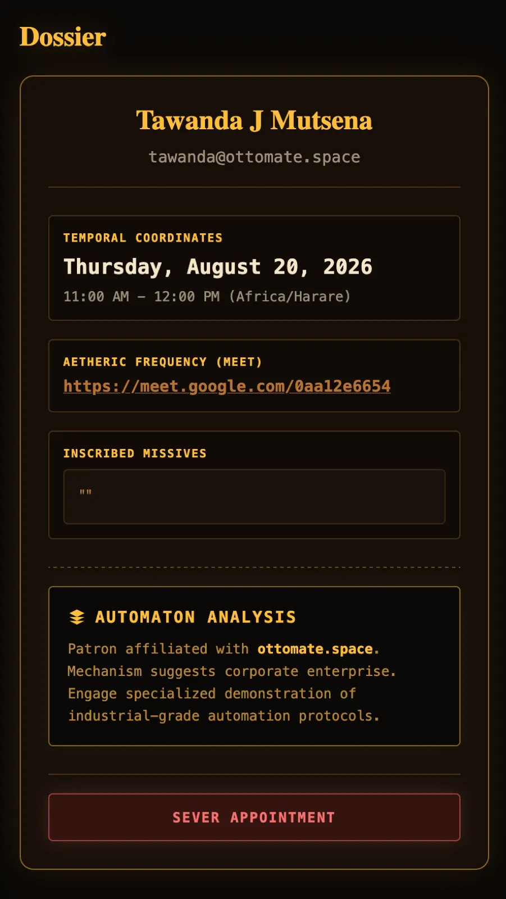
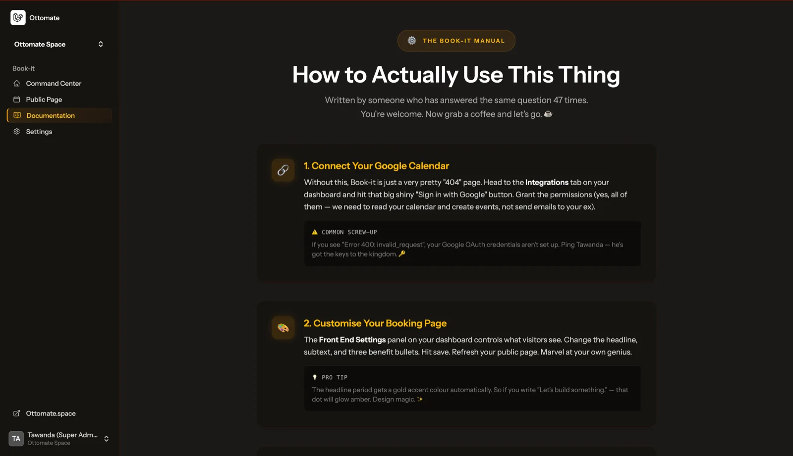

# BookIt — Screenshots & Media

Optimized images (WebP, ~1600px) for the README, docs, and social posts.

## Customer Booking Flow

| Image | Preview |
|-------|---------|
| Select Time & Date |  |
| Add Details |  |
| Booking Confirmed |  |

## Admin Dashboard

| Image | Preview |
|-------|---------|
| Dashboard Landing |  |
| Client Card List |  |
| Client Card (open) |  |
| Homepage Content Management |  |
| Time Blocking Settings |  |
| Meeting Info Card |  |
| Documentation Page |  |

## Usage

All images are WebP, resized to 1600px wide, optimized for fast loading. Use them in:

- GitHub README (see `README.md`)
- Blog posts and articles
- Social media snippets
- Portfolio showcase

Original source files (full-resolution PNGs) live at `/Users/mac/Documents/Works/Book-It/`.
